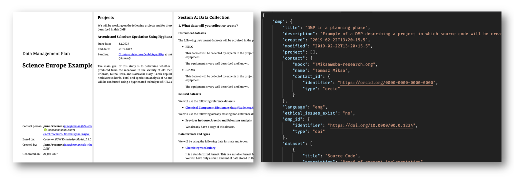

.. _document-template:

Document Template
*****************

Document templates transform the answers from a questionnaire to a document of a specific format. The document template usually follow some standard template, such as Horizon Europe DMP, and can support different formats, such as PDF or MS Word. The formats can be basically any text-based format, so it can also be for example a JSON or XML. It follows that we can easily use them to crate a machine-actionable output, too.

   Document templates can transform the answers from questionnaires to different formats, such as human-readable PDF or machine-actionable JSON.

It is important to note that the document template always define what :ref:`knowledge models<knowledge-model>` it is compatibly with because in order to transform the answers to the document it needs to understand what the questions are and how the answers should be composed into a document.

We can get existing document templates in the :ref:`DSW Registry<dsw-registry>`, or create our own using :ref:`document template editor<document-template-editors>` or :ref:`DSW Template Development Kit (TDK)<dsw-tdk>`.
