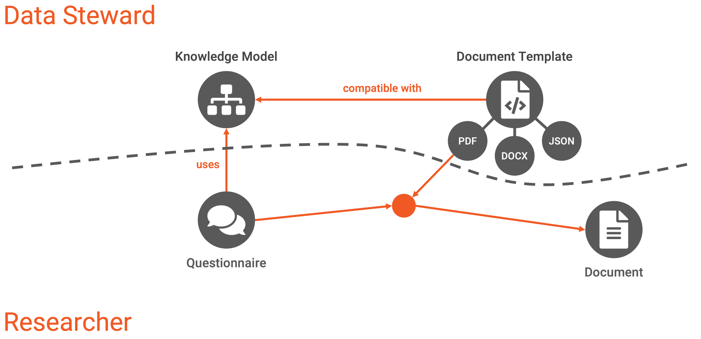

.. _overview:

Overview
********

Different components in the Data Stewardship Wizard are connected to create a data management plan and help with data management in general. Different components are typically made and used by different user roles. Data stewards work on preparing content (such as **knowledge models** or **document templates**) for researchers that they can use to work on their data management plans while filling in the **questionnaires** and exporting **documents**.

   Different components of the Data Stewardship Wizard and roles interacting with them.

Knowledge Model
===============

The knowledge model refers to something like a template for the questionnaire. However, it is not linear but has a tree-like structure with different branches based on the previous answer. Therefore, even if it can be complex overall, only the specific questions are used in the questionnaire.

:ref:`Learn more about knowledge models →<knowledge-model>`

Document Template
=================

While the knowledge model defines the structure of the questionnaire, it does not specify how the resulting document (such as the DMP) will look. We use document templates for that. They transform the answers into documents such as PDF, MS Word, or machine-actionable RDF. This way, we can only answer once and produce different documents.

:ref:`Learn more about document templates →<document-template>`

Questionnaire
=============

A questionnaire is part of a :ref:`project<project>` where researchers fill in their answers regarding their particular research. It uses a specific knowledge model that defines its structure.

:ref:`Learn more about questionnaires →<questionnaire>`

Document
========

Documents are produced from the questionnaire answers and a document template. The document template understands the knowledge model structure and knows how to transform the questionnaire answers into a specific document in the selected format. The documents are saved within a project where they were created from the questionnaire.

:ref:`Learn more about documents →<documents>`
