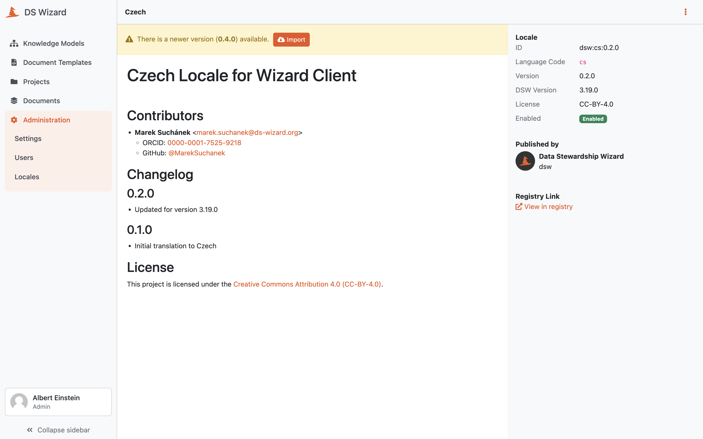

Locale Detail
*************

The detail of a locale provides us information about a locale after navigating to it from :doc:`./index`. The detail shows basic information about the locale such as its name, ID, language code (`RFC5646 <https://www.rfc-editor.org/rfc/rfc5646.html>`__, e.g. ``en`` or ``en-GB``), version, recommended compatible DSW version, license, and indication whether the locale is enabled or not.

The main part of the detail is the README of the locale that should contain basic information and changelog. In the right panel under the basic information, we can navigate to other versions of the locale.

In the top bar, we can :guilabel:`Export` the locale as a ZIP package, set or unset it as default, :guilabel:`Enable` or :guilabel:`Disable` it, or :guilabel:`Delete` this version of the locale.

.. NOTE::

    The default locale must be always enabled as it serves for users that did not have any preference or do not request matching locale directly using the browser configuration.

    
    Detail of a locale.
