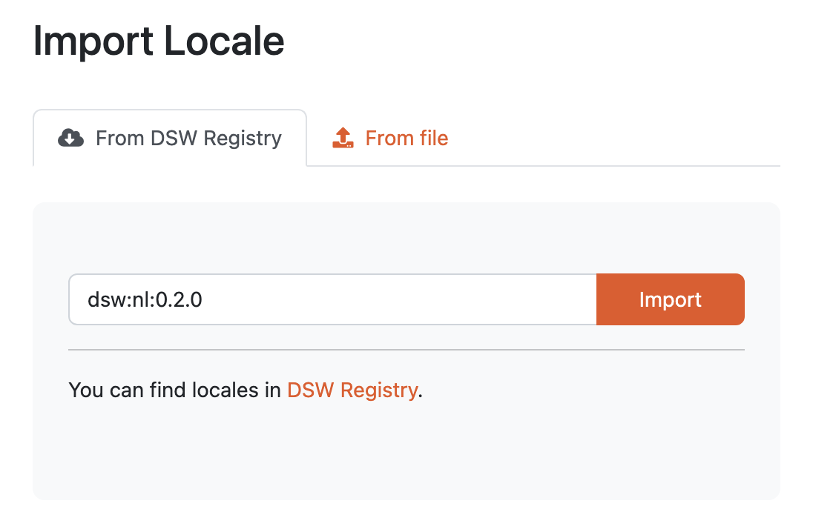
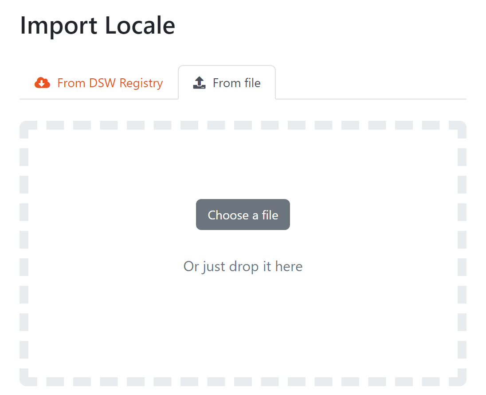

.. _locale-import:

Import Locale
*************

We can import an existing locale by navigating to :doc:`./index` (:menuselection:`Settings > Locales`) in the main menu and then clicking on :guilabel:`Import` button on the list of locales.

.. _locale-import-from-registry:

From DSW Registry
=================

If the DSW instance is connected to the `DSW Registry <https://registry.ds-wizard.org>`__, it is possible to import locales from it by entering the **locale ID** of desired template (e.g. ``dsw:cs:0.2.0``) and pressing the :guilabel:`Import` button.

.. NOTE::

    In case of locales present in the `DSW Registry <https://registry.ds-wizard.org>`__, we will be notified about the available upgrades.

    
    Input for importing a locale from DSW Registry.

From file
=========

We can import a locale as a ZIP package. Such a package can be created as an export from DSW.

    
    Input for importing a locale using a ZIP package.

