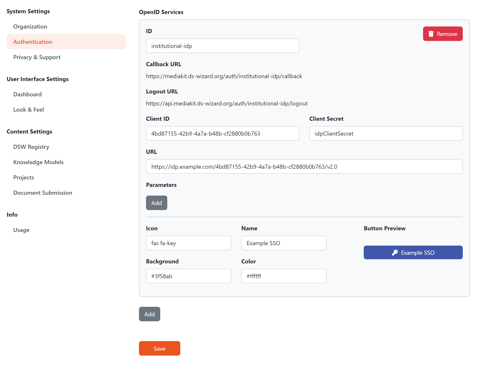

Authentication Settings
***********************

The **Default Role** settings option allows us to define which role is assigned to new users (see :ref:`user roles<user-roles>` for details about permissions).

.. WARNING::
    
    It is recommended to set this to the lowest role possible, i.e. **Researchers**. Otherwise, new users will be able to change the content for all other users in the DSW instance.

Internal
========

For internal authentication, we can set whether the **Registration** is enabled or not. If enabled, any user who can visit the DSW instance may sign up (and obtain the default role).

.. NOTE::

    In case we are using OpenID or creating user accounts manually, registrations should be disabled.

Another option is whether the **Two-Factor Authentication** (2FA) is enabled. If enabled, once users try to log in using credentials, they receive an email message with one-time code to confirm the login. Moreover, we can configure **Code Length** (how many character the code has) and **Expiration** period in seconds.

.. _auth-services:

External
========

Using these settings we can add **OpenID Services** to allow logging into the DSW instance via external identity provider. First, press :guilabel:`Add` and fill **ID** of the service (use only lowercase alphanumeric characters or dash symbols). Then, we should prepare the client application on the side of OpenID service:

*  Use **Callback URL** (and optionally **Logout URL**) to create the client
*  Obtain **Client ID** and **Client Secret**
*  Obtain OpenID endpoint **URL** (we may get one ending with ``/.well-known/openid-configuration``, if so we just use the part before this suffix)
*  Configure the client to have the following claims: ``openid``, ``profile``, ``email``
*  Configure the client to provide the following details in ID tokens: ``email``, ``given_name``, ``family_name``

Back in the DSW settings, we can fill **Client ID**, **Client Secret**, and **URL** from our OpenID client together with optional **Parameters** (usually not needed). Finally, we can configure how the log-in button will look like by setting **Icon** (by using `Font Awesome <https://fontawesome.com/v5/search>`_), **Name**, **Background**, and text/icon **Color**.

.. NOTE::

    After setting a new OpenID service, we should directly test it and verify that the configuration works well. For that, we can simply open our DSW instance in a new anonymous window of the web browser.

    
    Example configuration of OpenID service.
