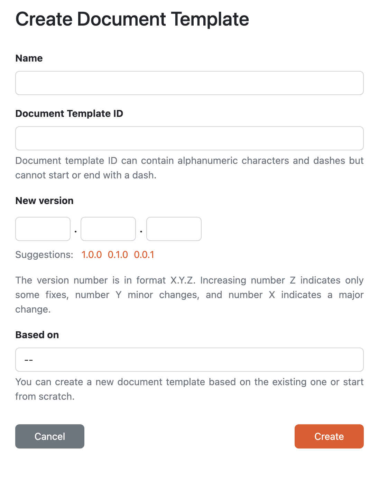

Create Document Template Editor
*******************************

We can create a new document template editor by navigating to :guilabel:`Document Templates > Editors` in the main menu and then clicking the :guilabel:`Create` button.

    
    Form for creating a new document template editor.

Every document template needs to have a **Name** and a **Document Template ID**. The name should be something descriptive to help users understand what the document template is about. The Document Template ID is used for the identification together with the :ref:`organization ID<organization-settings>` and document template version that we have to fill as a **New Version**. So the identifier of the document template is: 

.. code::

    <organizationId>:<documentTemplateId>:<version>

We can create a new editor either from scratch, i.e. the new document template will be empty and we will build it all ourselves, or based on an existing document template, which means that everything from the chosen document template (files as well as configuration) will be copied to ours. We just need to choose the original document template in the **Based on** field. Alternatively, we can click on :guilabel:`Create editor` from :doc:`../list/detail`.

We can only have one document template editor with the same document template ID. If we deleted the editor but want to continue working on that document template, we can create a new editor with the same document template ID. Alternatively, we would have to use a different document template ID.
