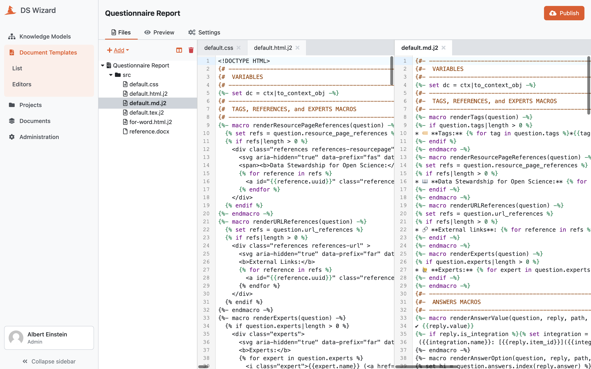

Files
*****

The :guilabel:`Files` tab in :doc:`./index` allows us to manage the files and directories (or folders) of the document template. There is a file tree on the left side whereas the main part is containing the built-in text editor. We can create a new folder or text file by clicking :guilabel:`Add` on the of top the file tree and then :guilabel:`File` or :guilabel:`Folder`. Once we enter a desired name, the folder or file is created in the active directory. Alternatively, we can upload a file by clicking :guilabel:`Add` and then :guilabel:`Upload`.

If we select a text file in the file tree, it is opened in the built-in text editor. We can also open multiple files (the editor supports tabs). Moreover, if we have more files opened, we can see a *split view* icon on the top of the file tree. When we click it, it will split the view and move the opened file to the other group. If there are already two groups, it switches the file between the two groups. We can close the file by clicking cross icon in its tab.

We can easily delete a file or a folder; when it is selected in the file tree, we can simply click the red trash icon above the file tree. The deletion must be confirmed in the prompt so we will not delete something by accident as it is not reversible operation.

If we make some changes in a file, the asterisk (or star) symbol will appear by the name in the tree view as well as in the tab (if opened). The changes must be then saved using :guilabel:`Save` button or discarded using :guilabel:`Discard` button in the top right corner. Those buttons will appear instead of :guilabel:`Publish` as it is not possible to publish a document template with unsaved changes. After saving the changes and switching to :doc:`./preview` (or refreshing it), the document will be re-generated using the newly changed document template.

    
    Files editor with tabs and split view.
