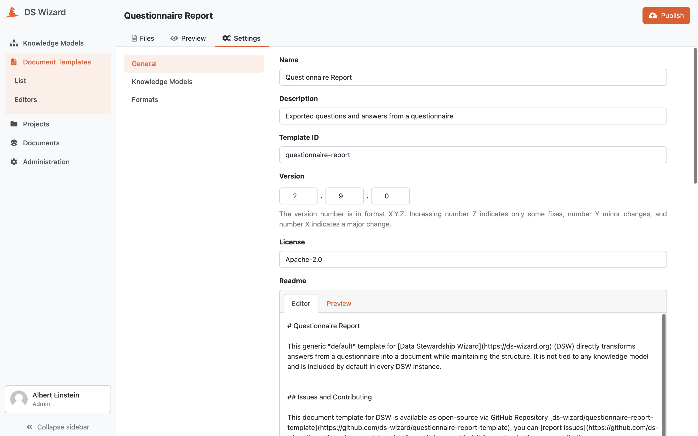

Document Template Editor
************************

A document template editor allows us to edit both configuration and all files of a document template. We can manage the configuration (such as template metadata, formats, and steps) on the :doc:`./template` tab. The files including directories can be managed (created, edited, deleted, or uploaded) on the :doc:`./files` tab. Finally, the :doc:`./preview` tab allows us to quickly check how the document template works for a certain project and format and how the resulting document looks like.

There is also option to :doc:`./publish` the document template via :guilabel:`Publish` buttom in the top right corner.

    
    Document template editor.

.. raw:: html
    
    <h2>Table of Contents</h2>

.. toctree::
    :maxdepth: 2

    Template<template>
    Files<files>
    Preview<preview>
    Publish<publish>
