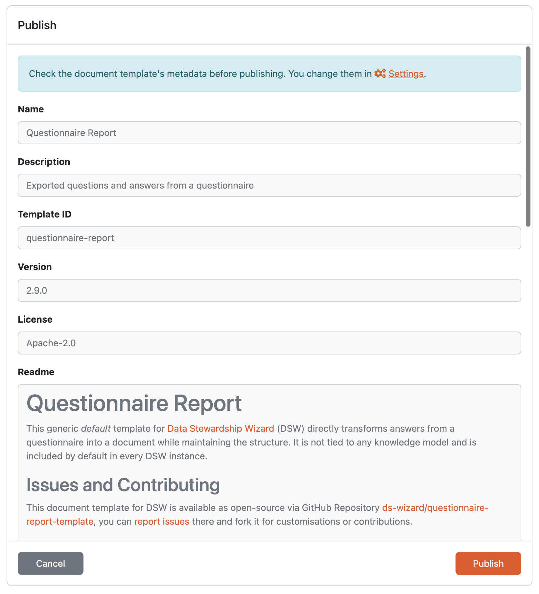

Publish
*******

Once we are ready with our document template in the editor, we can publish a new version by using the :guilabel:`Publish` button located in the top right corner of :doc:`./index`. If we click the button, we can check the metadata details and confirm the publishing. We cannot change anything here, so if we want to make some changes, we have to press :guilabel:`Cancel` and edit the details on the :doc:`./settings` tab of the :doc:`./index`.

If we confirm the publishing of the document template by clicking :guilabel:`Publish` in the modal window, the document template becomes available to all users and is accessible in :doc:`../../list/index`. Moreover, the document template editor disappears (as the state of the document template changed). If we want to directly continue in developing a new version, we have to :doc:`../create`.

    
    Confirmation of document template publishing.
