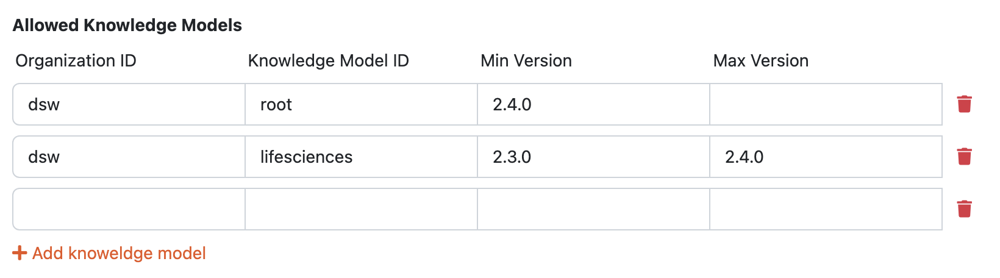
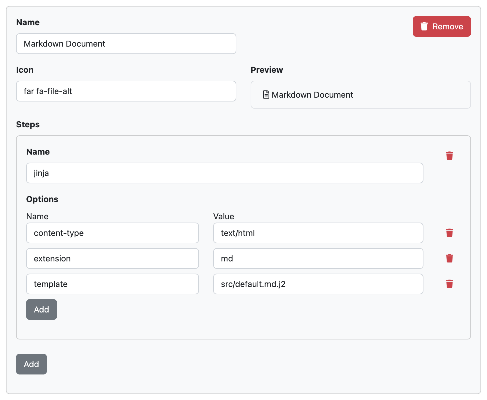

Settings
********

The :guilabel:`Settings` tab of :doc:`./index` allows us to adjust the configuration and metadata of the document template. It is split to the following three parts:

General
=======

This part allows us to change the metadata about the document template:

- **Name** should be short name of the template.
- **Description** should be short and descriptive (users will see it while selecting a document template).
- **Template ID** is the document template ID (as explained for :doc:`../create`).
- **Version** of the document template.
- **License** should contain a name of used license (e.g. *Apache-2.0* or *unlicensed*).
- **Readme** can contain a longer description, acknowledgements, notes how to use the template, links to resources, and a changelog.

Knowledge Models
================

We can specify here what knowledge models are compatible with our document template. This is useful to capture if our template is usable only with a certain knowledge model(s) which will guarantee us some content (specific chapters, questions, answers, etc.). For each entry, we are prompted to specify the **Organization ID**, **Knowledge Model ID**, **Min Version**, and **Max Version**. Any of these value can be left empty which means *any value*.

For example, if we set **Organization ID** to *dsw*, **Knowledge Model ID** to *root*, **Min Version** to *2.4.0* and leave **Max Version** empty, it will mean knowledge model *dsw:root:2.4.0* and any higher version. So that example would work for *dsw:root:2.4.4* or *dsw:root:2.5.0* but not for *dsw:root:2.3.0* nor *acme:base-km:2.6.0*

    
    Allowed knowledge models specification for a document template.

Formats
=======

Each document template can support multiple file formats and users will be able to select which one they want to use to generate (or preview a document). We can add a new format by clicking :guilabel:`Add` button. Then, each format must have a **Name** and **Icon** (by using `Font Awesome <https://fontawesome.com/v5/search>`_). 

Each format has some steps which capture how a file for that format is produced. There are different steps defined such as ``json``, ``jinja2``, ``pandoc``, or ``wkhtmltopdf`` which is used as its **Name**. Then, the step may have certain configuration **Options**. For example, ``jinja2`` must have ``content-type``, ``extension``, and ``template`` specified. All the possible steps and their options are further described in the :ref:`Document Template Development<document-worker-steps>`.

    
    Markdown format specification with ``jinja`` step.
