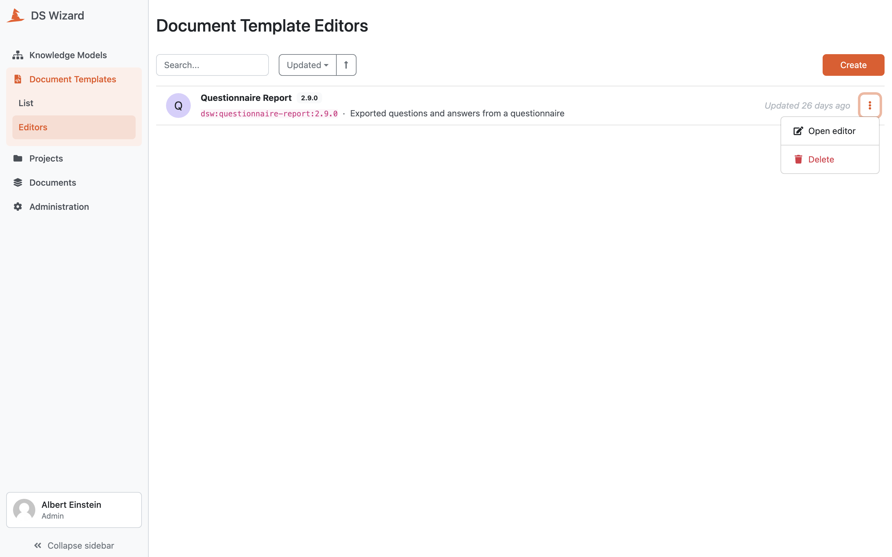

.. _document-template-editors:

Document Template Editors
*************************

On this page, we can see a list of all document template editors. Everyone with the data steward role assigned can see all the document template editors and use them.

.. TODO::

    figure

We can use the search field to search for a specific document template editor. The editors are sorted by when they were last updated but we can change that.

We can :doc:`./create` by clicking the :guilabel:`Create` button.

By clicking the triple dots on each of the item in the list we can access some actions:

- **Open Editor** - simply open the :doc:`./detail/index` (we can also click the name of the editor)
- **Delete** - to delete the document template editor (cannot be undone)

    
    List of document template editors with actions.

.. raw:: html
    
    <h2>Table of Contents</h2>

.. toctree::
    :maxdepth: 2

    Create<create>
    Detail<detail/index>
