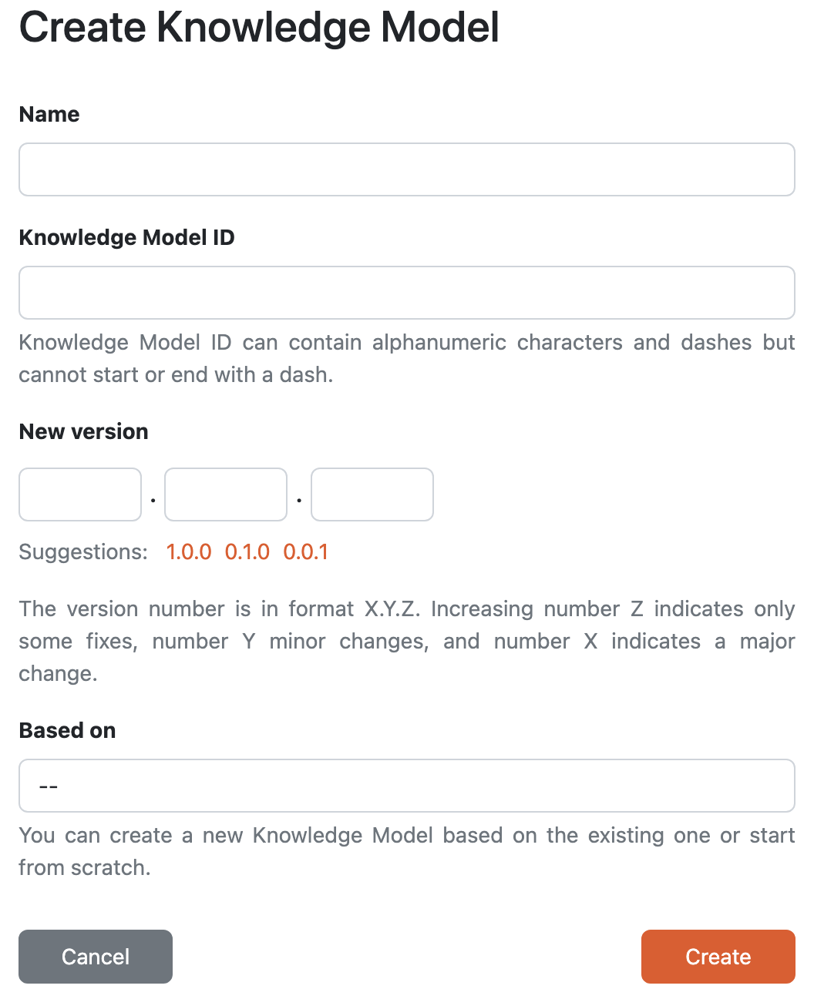

.. _create-knowledge-model-editor:

Create Knowledge Model Editor
*****************************

We can create a new knowledge model editor by navigating to :menuselection:`Knowledge Models → Editors` in the main menu and then clicking the :guilabel:`Create` button.

    
    Form for creating a new knowledge model.

Every knowledge model needs to have a **name**, a **knowledge model ID** and **version**. The name should be something descriptive to help users understand what the knowledge model is about. The knowledge model ID is used for the identification together with the :ref:`organization ID<organization-settings>` and knowledge model version after it is published. So the identifier of the knowledge model is: 

.. code::

    <organizationId>:<knowledgeModelId>:<version>

We can create a new project either from scratch, i.e. the new knowledge model will be empty and we will build it all ourselves, or based on an existing knowledge models, which means that everything from the chosen knowledge model will be copied to ours. We can start from there and add, delete, or modifiy the existing entities in there. We just need to choose the original knowledge model in the **based on** field. Alternatively, we can open the :ref:`knowledge model detail<km-detail>` and click on :guilabel:`Fork KM` there.

We can only have one knowledge model editor with the same knowledge model ID. If we deleted the editor but want to continue working on that knowledge model, we can create a new editor with the same knowledge model ID. Or we can open the :ref:`knowledge model detail<km-detail>` and click on :guilabel:`Create KM editor` there to have the editor create form prefilled.
