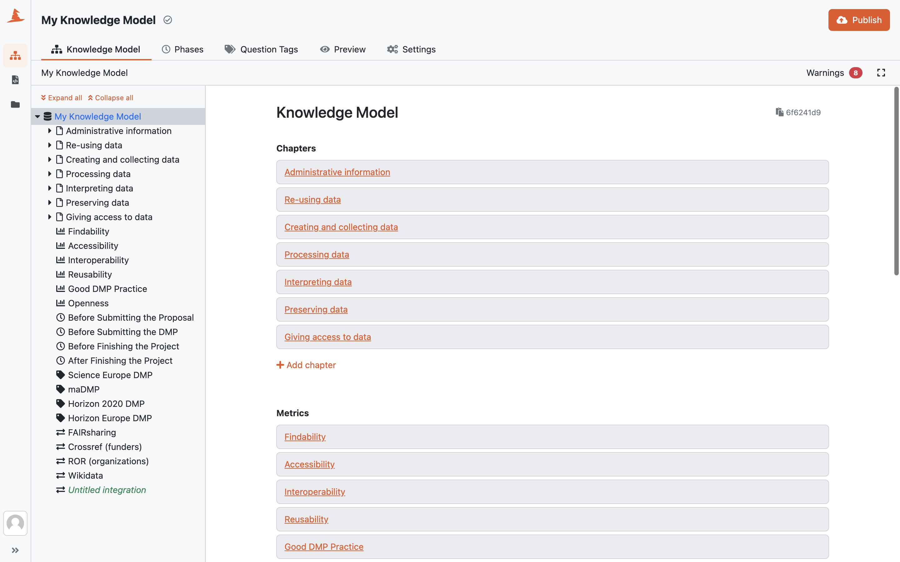

.. _knowledge-model-editor:

Knowledge Model Editor
**********************

Knowledge model editor is where we build knowledge models. In this section, we will see what entities we can add there, how they are connected, how to work with the editor and how to publish the knowledge model.

    
    Knowledge model editor.

.. raw:: html
    
    <h2>Table of Contents</h2>

.. toctree::
    :maxdepth: 2

    knowledge-model
    phases
    question-tags
    preview
    settings
    publish
