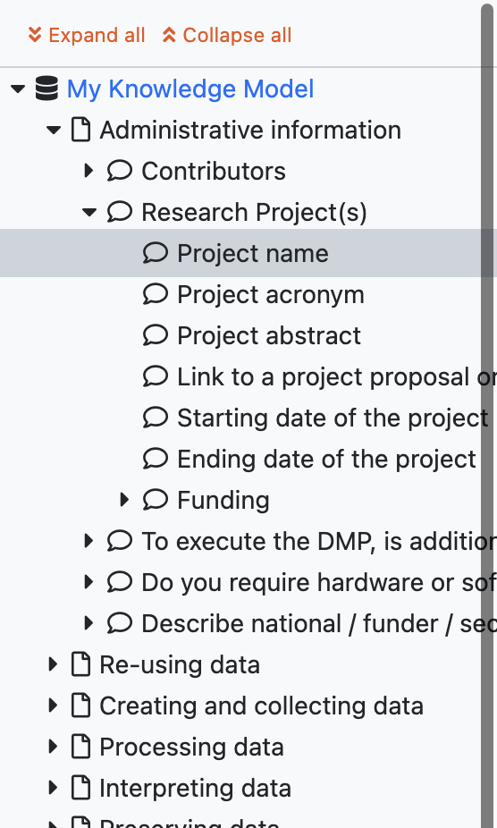
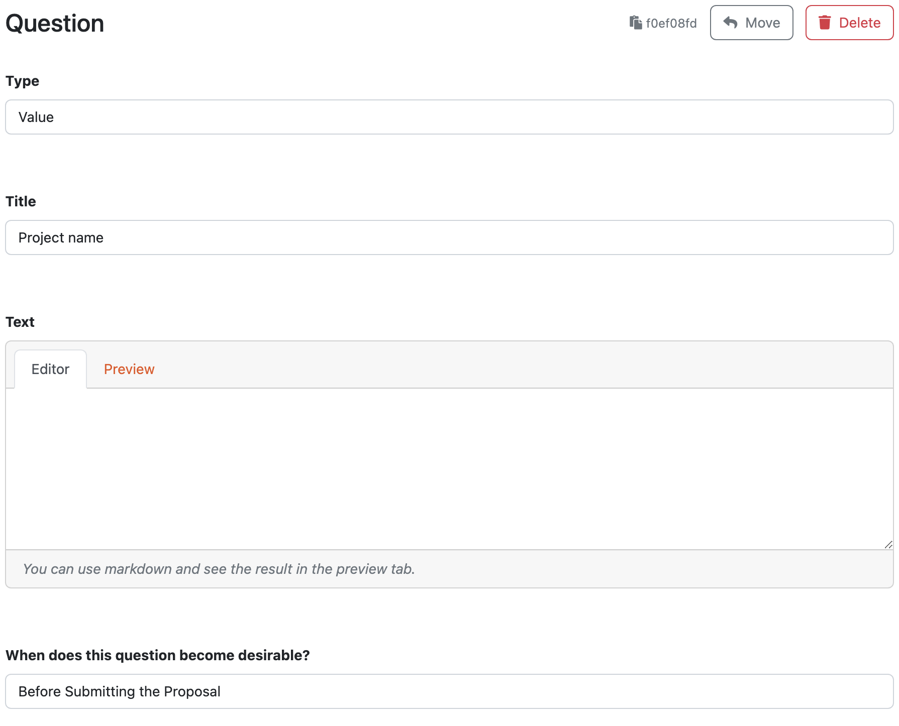
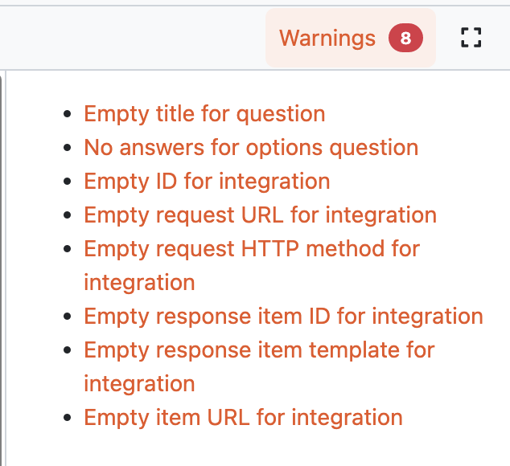

Knowledge Model
***************

The :guilabel:`Knowledge Model` tab is where we work on the entities (such as questions or answers) that appear in the knowledge model. We define the structure here.

Navigation
==========

In the top row, we can see the breadcrumbs that show us where we are within the knowledge model. This allows us to quickly jump back up in the hierarchy.

On the lefthand side of the editor, there is a navigation tree reflecting the structure of the knowledge model. We can click on the arrows to expand or collapse individual entities, or click on :guilabel:`Expand all` or :guilabel:`Collapse all`. By clicking on the entity name, we open its editor.

    
    Knowledge model editor navigation.

.. TIP::

    There is no search, however, if we want to quickly find an entity by name we can click on :guilabel:`Expand all` in the navigation tree and use search functionality of our web browser.

Editors
=======

The main area of the :guilabel:`Knowledge Model` tab is the actual editor. The form fields change based on the entity we edit, but there are some shared actions:

    
    Editor action buttons.

- **Copy UUID** - every entity has a generated UUID, we can use this button to copy it. We usually need it for :ref:`document template development<document-template-development>`.

- **Move** - we can move entities around the knowledge model. However, not every entity can be put under everything. We can open the move modal window and see where the current entity could be move to.
  
- **Delete** - delete is simply used for deleting the entities. This action cannot be undone, so we need to be careful what we delete.

There are different entities we can edit in the knowledge model, the editor shows different fields based on what we edit:

- :ref:`Knowledge Model<knowledge-model>`
- :ref:`Chapter<chapter>`
- :ref:`Question<question>`
- :ref:`Answer<answer>`
- :ref:`Choice<choice>`
- :ref:`Reference<reference>`
- :ref:`Expert<expert>`
- :ref:`Metric<metric>`
- :ref:`Phase<phase>`
- :ref:`Question Tag<question-tag>`
- :ref:`Integration<integration>`

    
    Example of question editor form.

Besides their own fields, each entity has so called **Annotations**. They are arbitrary key value pairs that can be assigned to the entity and used later, when :ref:`developing a document template<document-template-development>`.

Warnings
========

The editor checks for some possible problems, such as empty title for a chapter or no answers for an options question. If there are any, the :guilabel:`Warnings` tab appear and we can quickly navigate to those problems and fix them.

    
    Warnings in the knowledge model editor.
