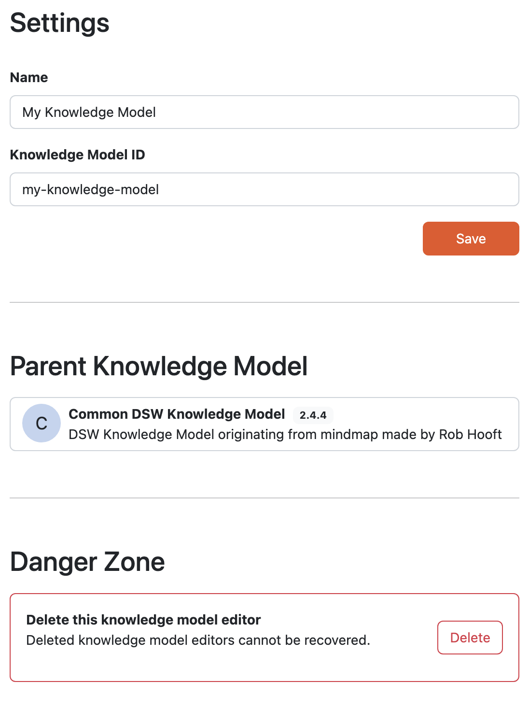

Settings
********

The :guilabel:`Settings` tab, allows us to adjust atributes of the the knowledge model:

- **Name** - should be short name of the Knowledge Model.
- **Description** - this should be really short and descriptive.
- **Knowledge Model ID** - is an unique Knowledge Model identifier.
- **Version** - this is a number indicating which is the latest version of the Knowledge Model, because it can change over time.
- **License** - this is used when we want to share the knowledge model with other people so they know how they can do that. We recommend using a license identifier from `SPDX Licens List <https://spdx.org/licenses/>`_.
- **Readme** - this is where we can describe everything we need about the knowledge model. We can, for example, include a changelog of what changed in which version, etc. We can use :ref:`Markdown<markdown>` in this field to provide some nice formatting.

.. NOTE::

    **Name**, **Description** and **Version** are all visible to the researcher, when they select a Knowledge Model for their project. So the **Name** and **Description** should provide them with enough information to select a correct one.

    **Knowledge Model ID** together with the :ref:`organization ID<organization-settings>` and knowledge model version after it is published are used for the identification. So the identifier of the knowledge model is: 

    .. code::

        <organizationId>:<knowledgeModelId>:<version>

    For the version number we recommended using similar approach as in `semantic versioning <https://semver.org>`_. So when we have a version ``<major>.<minor>.<patch>``, change in the major version number indicates some breaking changes (deleting questions, significant changes in the questionnaire structure, etc.), change in minor version number indicates some new changes that are backwards compatible (i.e., adding a new question), and change in the patch version number indicate some fixes (such as fixing some typos).

If the knowledge model was based on another knowledge model, we can also see the **Parent Knowledge Model** in the settings.

In the **Danger Zone** we can delete the knowledge model. Once it is deleted it can **no longer be recovered**.

    
    Knowledge Model settings.
