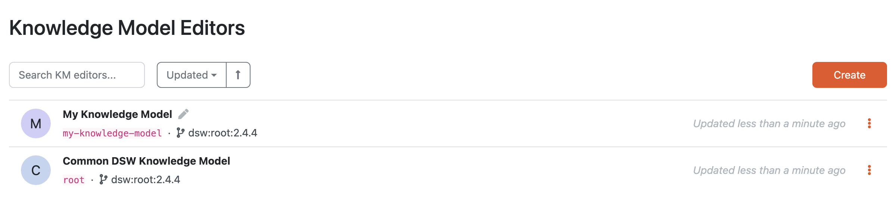

Knowledge Model Editors
***********************

Here, we can see a list of all knoweldge model editors. Everyone with the data steward role assigned can see all the knowledge model editors.

    
    List of knowledge model editors.

We can use the search field to search for a specific KM editor. The editors are sorted by when they were last updated but we can change that.

We can :ref:`create a new knowledge model editor<create-knowledge-model-editor>` by clicking the :guilabel:`Create` button.

By clicking the triple dots on each of the item in the list we can access some actions:

- **Open Editor** - simply open the :ref:`editor detail<knowledge-model-editor>`
- **Upgrade** - if there is a newer version of parent knowledge model, we can use upgrade action to start a :ref:`knowledge model migration<knowledge-model-migration>`, otherwise the action is not visible
- **Publish** - to :ref:`publish<knowledge-model-publishing>` a new version of the knowledge model
- **Delete** - to delete the knolwedge model editor (cannot be undone)

If there is an ongoing :ref:`knowledge model migration<knowledge-model-migration>`, there are different actions:

- **Continue migration**
- **Cancel migration**

.. raw:: html
    
    <h2>Table of Contents</h2>

.. toctree::
    :maxdepth: 2

    Create<create>
    Detail<detail/index>
    Migration<migration>
    