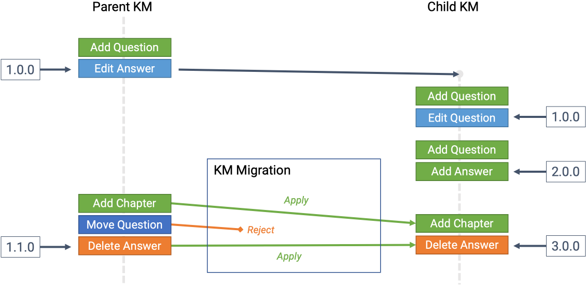
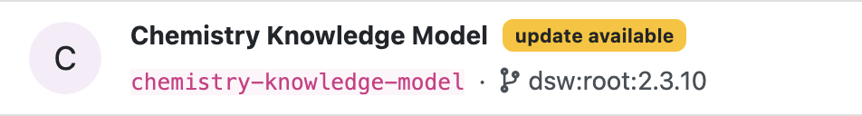
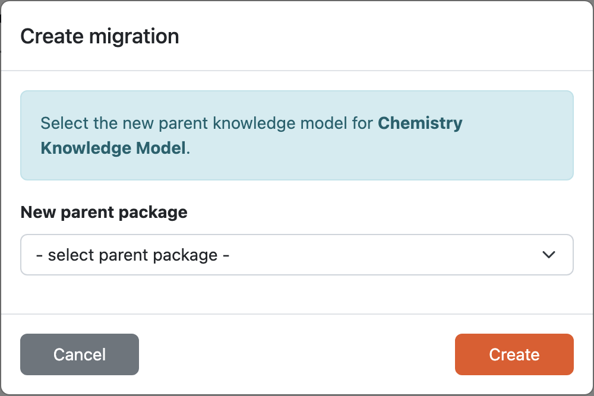
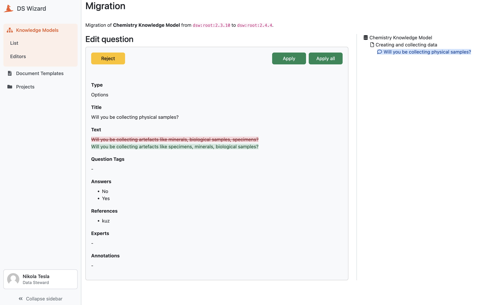

.. _knowledge-model-migration:

Knowledge Model Migration
*************************

Knowledge model can be created either from scratch or based on existing one and further modified. If that happened, we can call the original **Parent KM** and the modification **Child KM**. We can create the Child KM any :ref:`published version <knowledge-model-publishing>` of the Parent KM, make some modification and publish a version of the Child KM. However, the Parent KM can evolve, and at some point we might want to have those changes in our Child KM, too.

That is what the knowledge model migration is for. Once a new version of the Parent KM is published, we can start the KM migration where we go through these changes. We can choose whether we want to apply or reject these modification to our Child KM during migration. At the end, we publish a new version of the Child KM with all the selected changes.

    
    Schematic representation of KM migration.

Creating a Knowledge Model Migration
====================================

We can start the knowledge model migration from the :ref:`list of knowledge model editors<knowledge-model-editors>`. If there is a newer version of the Parent KM available for particular knowledge model editor, we can see the :guilabel:`update available` badge next to the name of the editor. 

    
    Badge indicating that there is a newer version of the Parent KM.

We can either click on the badge directly, or choose :guilabel:`Upgrade` option from the dropdown menu. It will open a modal window where we can choose a new version of the Parent KM that we want to migrate our Child KM to. Usually, we want to pick the latest.

    
    Modal window to create a new knowledge model migration.

Knowledge Model Migration
=========================

During the migration, we can see all the changes one by one and can choose whether we want to :guilabel:`Apply` or :guilabel:`Reject` the change. We can also choose to :guilabel:`Apply all` if we simply want everything.

    
    During the migration we can apply or reject the changes form the Parent KM.

Cancelling a Knowledge Model Migration
======================================

We can cancell the knowledge model migration at any point before we publish the new version of the Child KM. We need to navigate to the :ref:`list of knowledge model editors<knowledge-model-editors>` and choose :guilabel:`Cancel migration` from the dropdown menu for the desired KM editor.

Finishing a Knowledge Model Migration
=====================================

After we resolve all the changes, we are ready to publish the new version of the Child KM. The publishing process is the same as when :ref:`publishing from the KM editor<knowledge-model-publishing>`.
