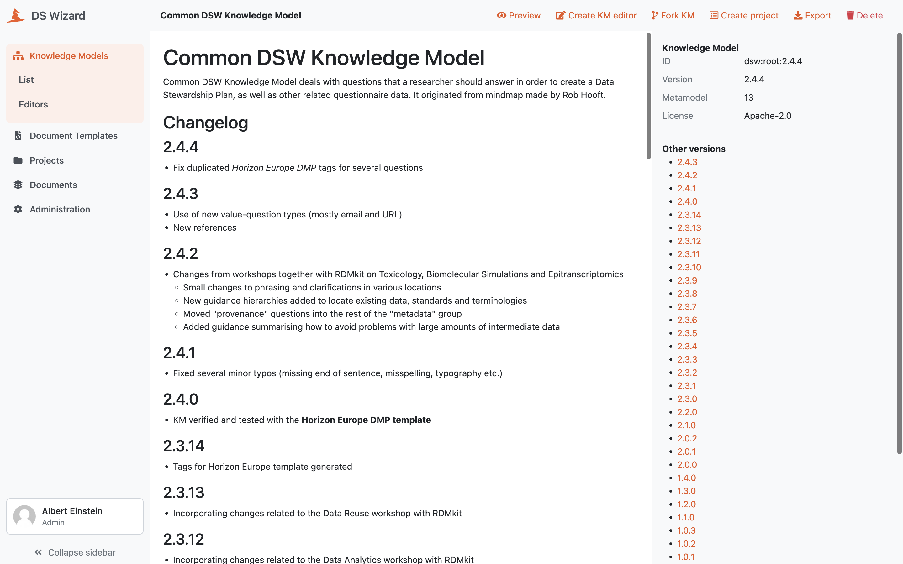

.. _km-detail:

Knowledge Model Detail
**********************

We can visit a knowledge model detail by clicking on a desired KM in the :doc:`./index` (or selecting :guilabel:`View detail` from the right item menu). The detail shows basic information about the knowledge model such as its name, ID, version, license, metamodel version, or (if applicable) what is the parent knowledge model).

The main part of the detail is the README of the KM that should contain basic information and changelog. In the right panel under the basic information, we can navigate to other versions of the KM or navigate to the `DSW Registry <https://registry.ds-wizard.org>`__ (if the KM is present there).

In the top bar, we can :guilabel:`Export` the knowledge model as a KM file or :guilabel:`Delete` this version of the knowledge model (only if it is not already used for some projects or other KMs and editors).

In the top pane, we can see the options based on our role:

- :guilabel:`Preview` can be used to check the content of the KM via the :doc:`./preview` feature.
- :guilabel:`Export` for exporting the latest version of the KM as a file.
- :guilabel:`Create KM editor` is a shortcut for :doc:`../editors/create` for creating a new version.
- :guilabel:`Fork KM` is again a shortcut for :doc:`../editors/create` for to create a fork (some more specific KM based on this one).
- :guilabel:`Create project` is a shortcut to :doc:`../../projects/list/create` with this KM.
- :guilabel:`Set deprecated` or :guilabel:`Restore` for setting a KM deprecated when we no longer want the **researchers** to use it.
- :guilabel:`Delete` the specific version of the KM (possible only if is not used in any projects or linked in other KMs and editors).

If we are not seeing the latest version of the KM, a warning message is shown in the top. Similarly, we will see a notification that update is available if there is a newer version in the `DSW Registry <https://registry.ds-wizard.org>`__ (if configured).

    
    Detail of a knowledge model.
