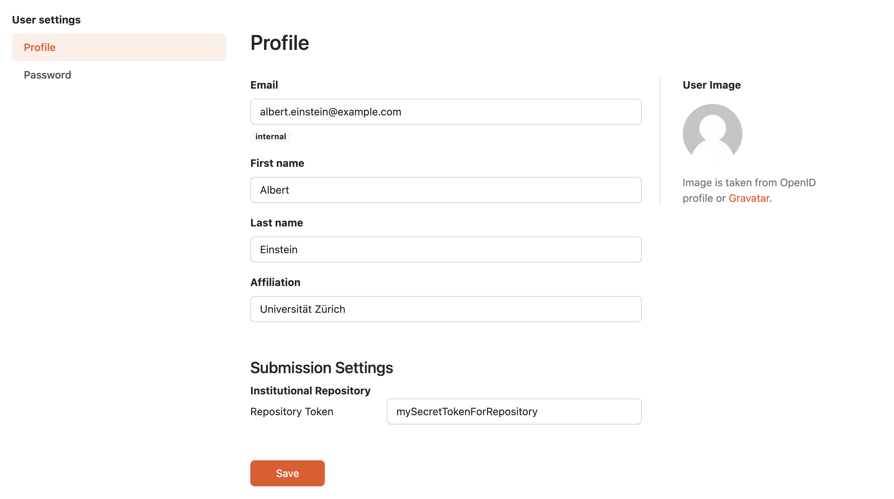

Edit Profile
************

After navigating to :guilabel:`Edit profile` from the :doc:`../index` menu, we can change the information of our profile: **Email** address, **First name**, **Last name**, and **Affiliation**. We need to submit the changes by clicking :guilabel:`Save` button.

In case of configured submission services, there might be additional inputs under **Submission Settings** such as API tokens or other information used for the document submission.

    
    Form for editting profile with example submission settings.

.. NOTE::

    The values of **Submission Settings** are treated as potentially sensitive information; thus are stored encrypted.

If we want to :doc:`./password`, we need to switch to :guilabel:`Password` from the left menu titled **User settings**.

----

.. raw:: html
    
    <h2>Table of Contents</h2>

.. toctree::
    :maxdepth: 2

    Change Password<password>
    