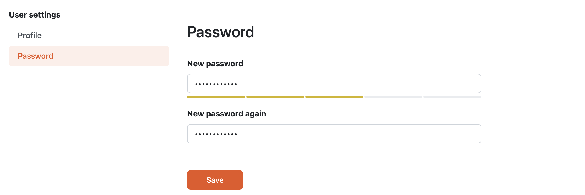

Change Password
***************

The password be can changed after navigating using :guilabel:`Password` from the :doc:`./index`. Here we can simply enter new password (it must be strong enough), repeat it again and press :guilabel:`Save` button.

    
    Form for changing password.
