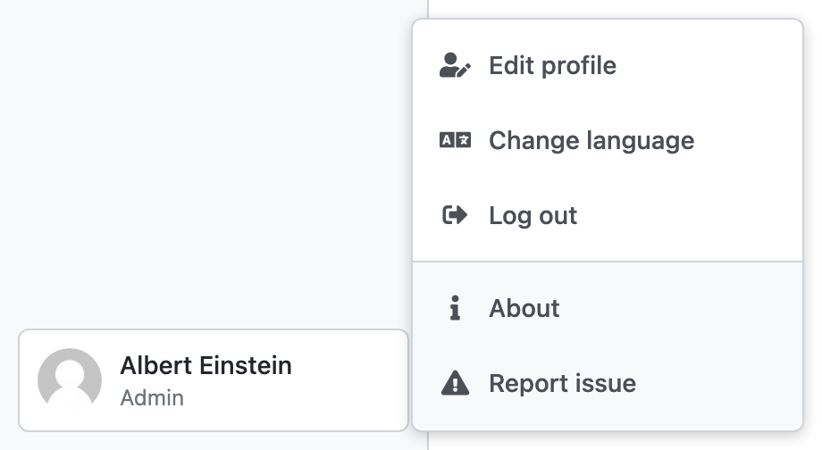

Profile
*******

As every logged-in user, we can manage our own profile. We can see the options by hovering over the box with our name and avatar in the lower part of the left sidebar with main menu (only avatar is shown in case of collapsed sidebar). From there, we can navigate to :doc:`./edit/index`. If locales are configured, we can also :doc:`./language`.

Moreover, there are also options to :guilabel:`Log out`, see basic information about the DSW instance using :guilabel:`About`, or in case of problems we can use :guilabel:`Report issue` to know how to proceed.

    
    Profile menu.

----

.. raw:: html
    
    <h2>Table of Contents</h2>

.. toctree::
    :maxdepth: 2

    Edit Profile<edit/index>
    Change Language<language>
    