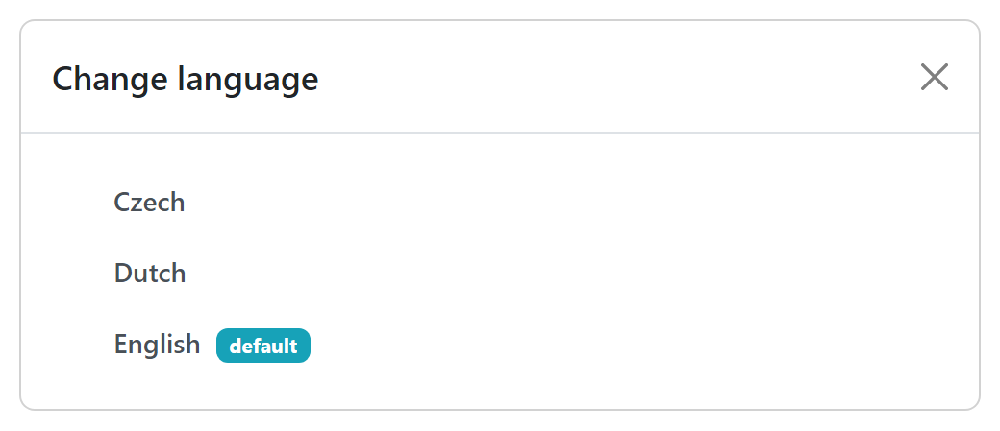

Change Language
***************

A user can explicitly select a desired language after clicking :guilabel:`Change language` from the :doc:`./index` menu. In case the language becomes unavailable later after the selection, it will fall back to the one marked as **default**.

    
    Modal window with language selection.

.. NOTE::

    The selection of language is saved only locally in the browser (in local storage), so if we log in from different locations, we need to select the language there again.
