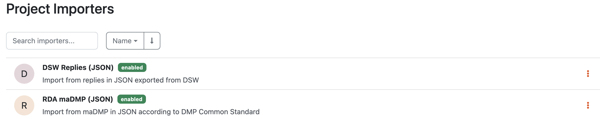

..  _project-importers:

Project Importers
*****************

.. WARNING::

    Project importers are an experimental feature.

We can use project importers to import data from different DSW instances or even different applications to DSW. Each has a set of supported knowledge models defined. This is because each knowledge model has a different structure and the importer needs to understand it so it can import the answers to the correct questions.

.. NOTE::

    Only data stewards or admins can access project importers.

If we navigate to :guilabel:`Projects → Importers`, we can see the list of all available importers. We can enable or disable them by clicking on the triple dots icon and choosing the appropriate action.

    
    List of project importers where we can enable or disable them.

More information about how to develop project importers is available on the :ref:`project importers development<development-importers>` page.