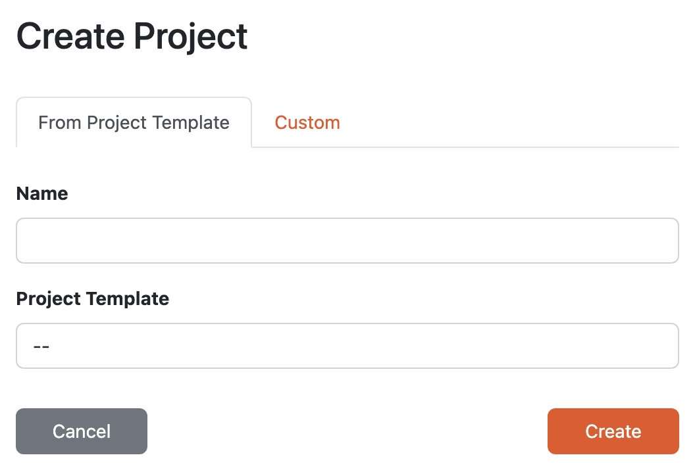

.. _create-project:

Create Project
**************

We can create a new project by navigating to :guilabel:`Projects` in the main menu and then clicking on :guilabel:`Create` button on the project list.

.. NOTE::

    If we have **Researcher** role we also have a **Create Project** widget on our dashboard right after logging in. We can click on :guilabel:`Create` button there, too.

Based on our instance configuration, we can create the new project from a project template, custom, or both.

    
    Different options how to create a project.

.. _from-project-template:

From Project Template
=====================

There are many options how to create and configure a project, such as what :ref:`knowledge model<knowledge-model>` or :ref:`document template<document-template>` to use. :ref:`Project templates<project-templates>` are prepared projects by data stewards with possibly pre-selected knowledge models and document templates, they can have some pre-filled answers, comments and TODOs as well.

So if there are any project templates created in our instance, we can use them to have a smoother start of our project. We just need to give our project a **name** and choose the **project template** from offered options.

Custom
======

If there are no project templates available or we don't want to use them, we can choose to create a custom project. We need to give our project a **name** again, but this time we choose a :ref:`knowledge model<knowledge-model>` from offered options.

This will create an empty project with only the selected knowledge model and we need to configure everything (such as a document template) ourselves.
