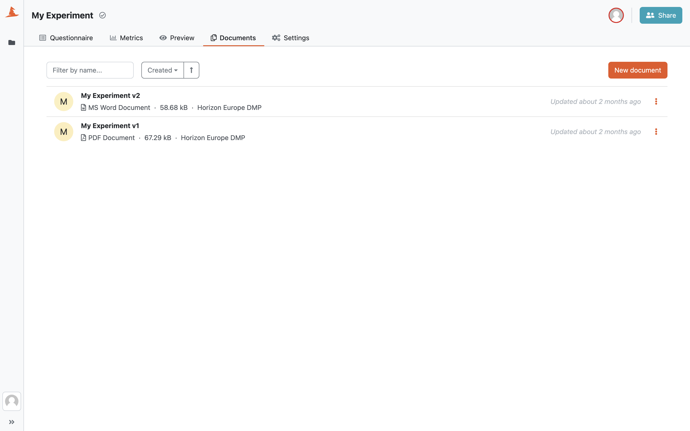
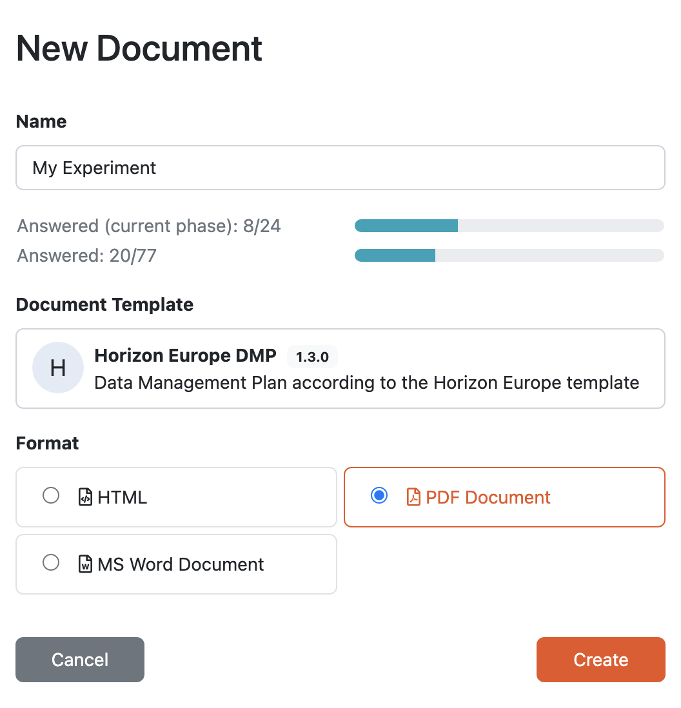
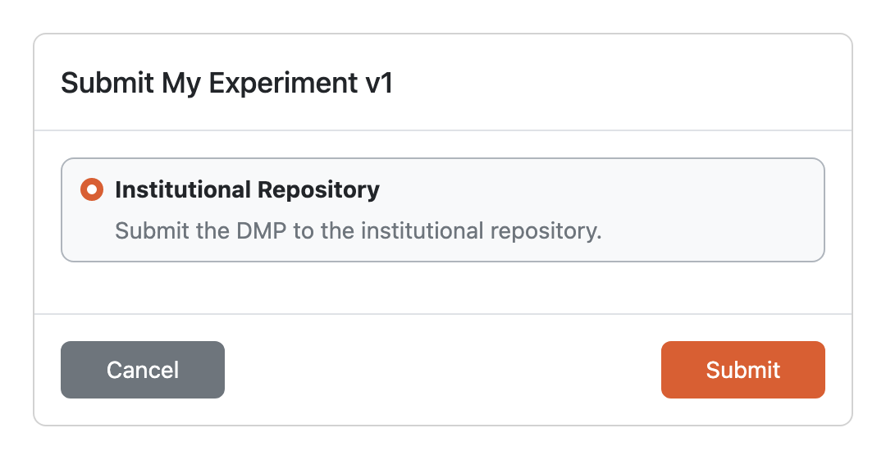

Documents
*********

In the :guilabel:`Documents` tab in the project detail we can manage the documents related to the project. We can see a list of all the documents with their **format**, **file size**, and **document template** used to create that document.

While we can quickly see how the current state of the questionnaire looks like in the document in the :ref:`preview<preview>` tab, the documents created here are persistent. That means that the once the document is created, it is immutable and you can always download it later, after you have changed the questionnaire, and it will still be the same.

    
    List of the documents on the project.

.. _new-document:

New document
============

We can click on :guilabel:`New document` when we want to create a new document. We need to give a name to our new document (project name is prefilled) and choose the **document template** and **format**. If there is a :ref:`default document template and format<default-document-template>` set for the project, they are prefilled in this form. However, we can change them to whatever we want before creating the document. Once we hit :guilabel:`Create`, we are taken back to the document list and we'll see the new document there (it might take while before it is generated though).

    
    We can choose any compatible document template and format when creating a new document on the project.

Document Submission
===================

:ref:`Submission services<submission-service>` can be used to quickly submit the document directly from DSW to some external service.

    
    Submission service selection for a document.

If there are any document submission services configured for our DSW instance, we should be able to see :guilabel:`Submit` option when we open document menu in the document list by clicking on the triple dots. Then we choose the desired from the list and click on :guilabel:`Submit`.

We can see all the submissions for each document in the document list as well.