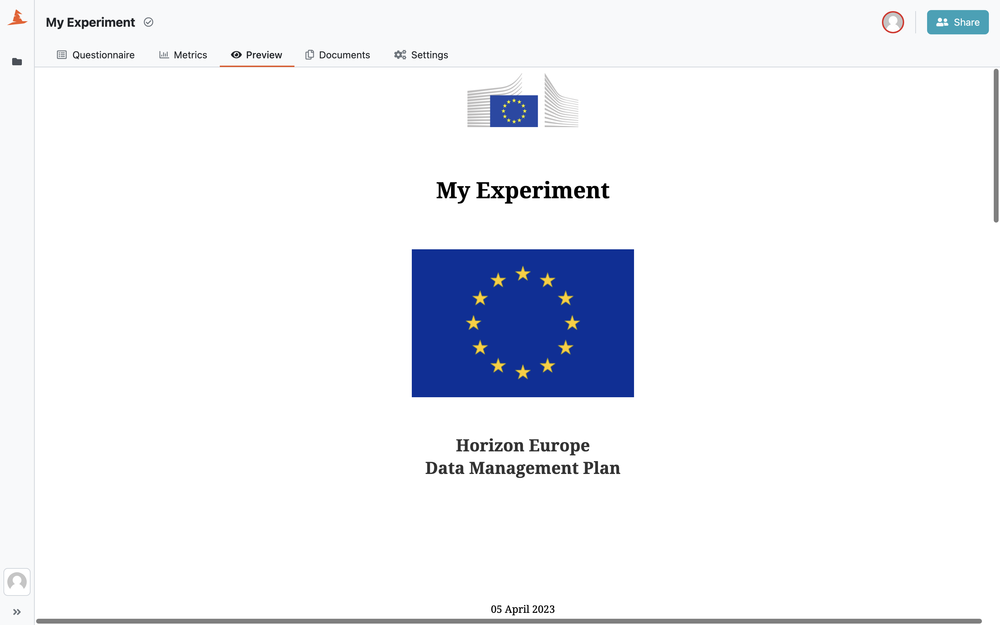
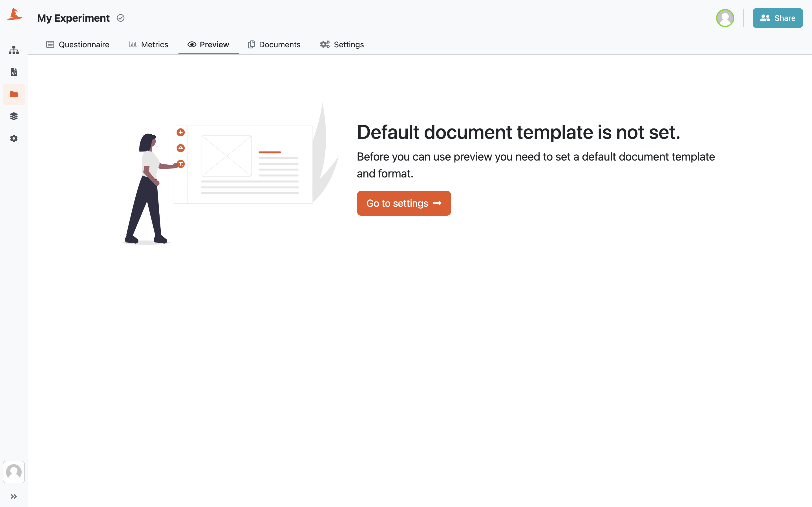
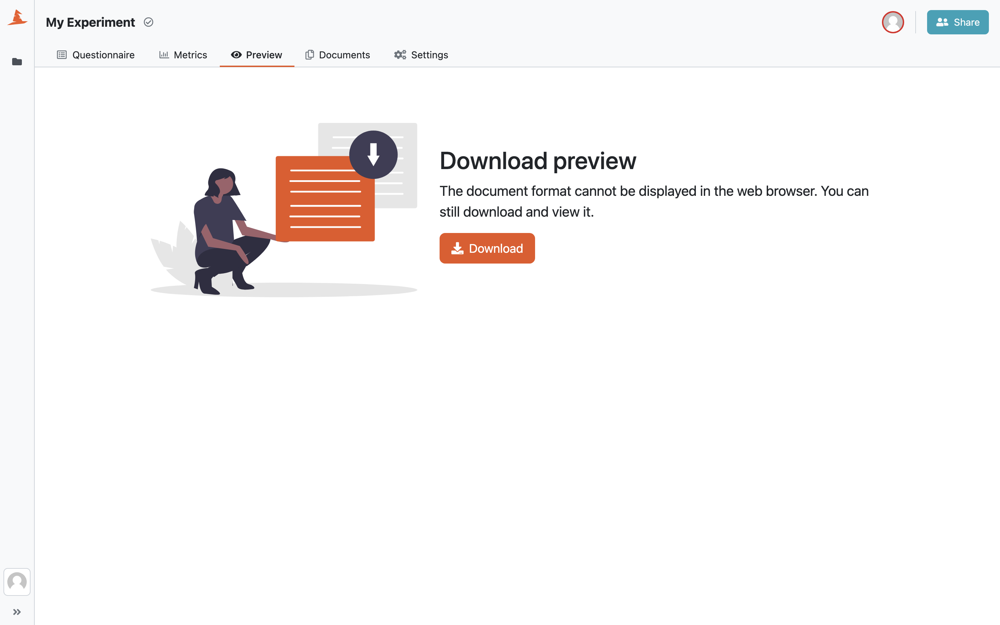

.. _preview:

Preview
*******

We can quickly see how the resulting document would look like in the :guilabel:`Preview` tab.

    
    Document preview in the project detail.

Default Document Template Not Set
=================================

The preview uses the default document template. If there is no default document template set in the :ref:`project settings<default-document-template>`, we need to set it first.

    
    Preview only works when the default document template is set.

Download Preview
================

Not all formats can be displayed in the web browser, for example a MS Word document. In that case, we'll be able to download the document instead of previewing it.

    
    Some formats cannot be displayed in the web browser.
