.. _project-questionnaire:

Questionnaire
*************

Questionnaire is the first tab of the project detail. This is the most imporant part where we fill in all the details about our project.

Current Phase
=============

If the :ref:`knowledge model<knowledge-model>` we use for the :ref:`project<project>` has :ref:`phases<phase>` defined, we can see a phase selection in the questionnaire detail. Different questions become desirable based on the selected phase. For example, some should be answered before submitting the proposal, while others can be filled later.

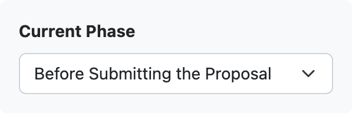
    
    Phase selection widget.

By selecting the phase we are currently in, we can see the desirability of questions. We can also see the number of questions that still need to be answered in this phase for each chapter in the chapter list.

There are three desirability states the question can be in:

- **red, with a pen icon** - this question must be answered in the current phase
- **light grey, with an hourglass icon** - this question will have to be answered in some later phase
- **green, with a checkmark icon** - this question has already been answered

.. NOTE::

    If there is no phase defined on the knowledge model, the current phase selection is not visible in the questionnaire detail.

Chapters
========

Below the current phase selection, we have a list of :ref:`chapters<chapter>`. We can see the number of questions that are yet to be answered in current phase (or overall if there are no phases defined in the knowledge model). We can use this list to navigate freely between chapters.

For the opened chapter, we can see a navigation tree for the chapter structure, showing the questions, follow-up questions, items, etc. We can use this tree to quickly navigate to a specific question in the chapter.

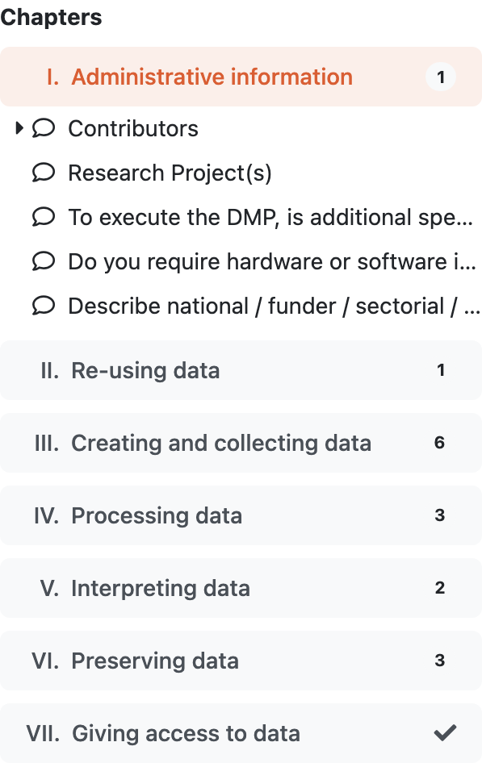
    
    Chapter list showing the also the questions for the opened chapter.

Questionnaire Area
==================

The questionnaire area fills the most space in the questionnaire screen. It displays the questions and answers from the opened chapter.

Each question has an identifier which indicates the chapter it belongs to, as well as its order and nesting within the chapter. For example, **I.1.a.5**, where the Roman numeral represents the number of the chapter, and the remaining numbers indicate the order and nesting of the question. Then there is also the question name.

Some additional information can also be part of the question:

- **Question tags** - can indicate some additional groupping of questions, for example what DMP templates is this question used for
- **Description** - additional information explaining the question
- **Desirability** - what phase this question become desirable in
- **List of references** - links to additional external resources related to the question
- **List of experts** - whom to contact when help is needed with answering the question

Based on our role in the project and specific instance settings there are some additional actions besides answering the question:

- :ref:`Add TODO<todos>`
- :ref:`Add comment<add-comment>`
- Provide feedback for the question

We can get more information on how various collaboation tools work and can be used in :ref:`Sharing<sharing>`. 

The most important part is, however, answering the question. The way of how to answer the question differs based on the question type.

The following video tutorial explains questions and different question types in more detail.

.. youtube:: buG5BjWPs70
    :width: 100%
    :align: center

Options Question
----------------

Options question has a list of pre-set answers and we can choose one from those. There can be some follow-up questions (indicated by the icon by the answer). These questions are displayed only if we select that answer.

If there are some merics set for the answers, we can see labels with the metrics by the answer as well. The color of the label indicates how good or bad the answer is (red means bad, green good, yellow something in between).

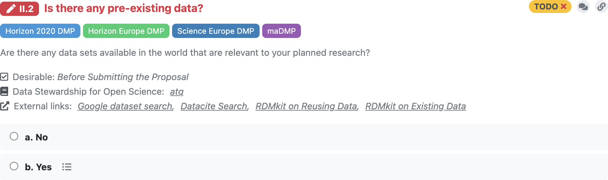
    
    Options question with a closed set of answers.

List Question
-------------

List question doesn't have a simple answer but a list of items. Each of the items has the same set of subquestions. For example, a list question asking about the project contributors where each item represent one contributor with questions about their name, role, etc.

We can simply click on :guilabel:`Add` button under the question to add a new item. Then, we can answer the questions for the item. If the item has a lot of questions, we can use the arrow icon in the item's top left corner to **fold/unfold** the item.

There is a trash bin icon in the item's top right corner that we can use to **delete** the item. If there are more than one item, there are also arrow icons that we can use to **change the order** of the items.

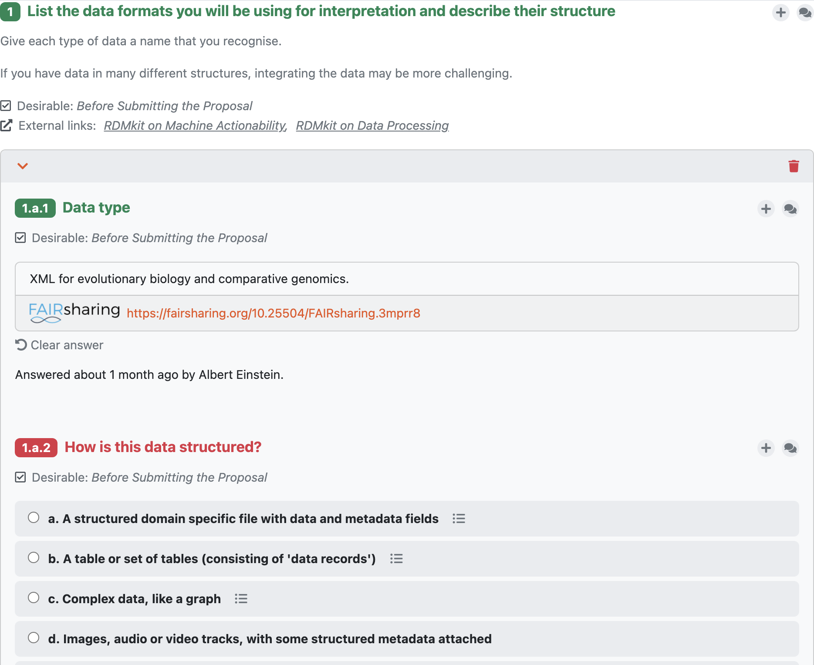
    
    List question with a single item.

Value Question
--------------

Value question contains an input field for our answer. This can be a simple text field (such as asking for a project contributor's name), or some additional widget, for example a date picker.

Some of the value types contains a validation (e.g., email or URL). We can still type in an invalid answer, but it will display a warning and also show it in the list of :ref:`warnings<warnings>`.

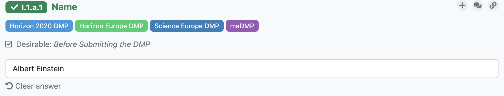
    
    Value question with a simple text input.

Integration Question
--------------------

Integration question is connected to an external resource where it searches for the answers. The input field works as a search field, so when we start typing something, it will search the external resource and offers us a list of possible answers.

When we pick an answer from the list, we not only have the answer but also **a link to the selected item in the external service**. If the answer we searched for is not there, we can simply keep what we have written in the input field. We just won't have the link with this answer.

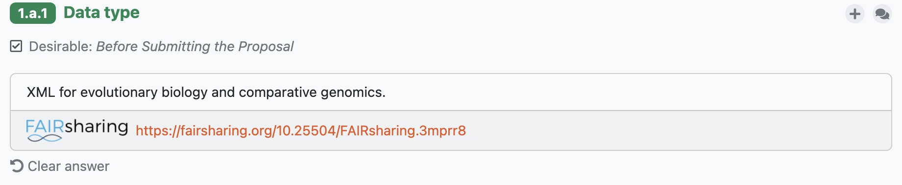
    
    Integration question with a response from FAIRsharing containing also a link.

Multi-Choice Question
---------------------

Multi-choice question is similar to the options question, however we can choose more there one answer and there are no follow-up questions.

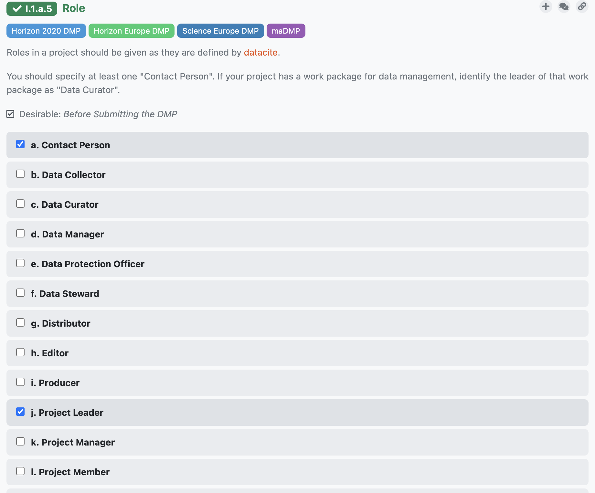
    
    Multi-choice question with many choices.

View settings
=============

In the questionnaire tab, there is a menu bar with various options. The first one is :guilabel:`View`, where we can show or hide some question details:

- :guilabel:`Answered by` - show/hide who and when answered questions
- :guilabel:`Phases` - show/hide what phase the questions are desirable in
- :guilabel:`Question tags` - show/hide the question tags
- :guilabel:`Non-desirable questions` - show/hide questions that are not desired to be filled in current phase
- :guilabel:`Metric values` - show/hide value of metrics for accessibility purpose

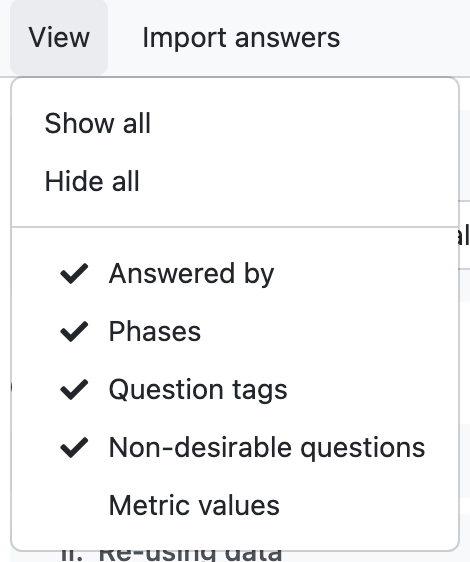
    
    Different view options accessible form the questionnaire toolbar.

Import answers
==============

Questionnaire answers can be imported for various sources using :ref:`project importers<project-importers>`.

If there are some project importers available for the project, there is the :guilabel:`Import answers` button in the questionnaire menu bar. We can choose one of the available importers there and then follow the instructions in the importer window.

.. _warnings:

Warnings
========

Some value questions (such as email or URL) validates the answer written there. If it is an invalid value, we will see :guilabel:`Warnings` tab in the questionnaire menu bar with a badge showing the number of warnings. If we click on it, we can see a list of all questions that has a warning and we can click on it to navigate quickly to that question.

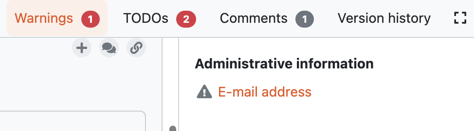
    
    Warnings refering to questions with invalid values.

Comments
========

We sometimes want to leave comments to discuss things with our team or just reminders for ourselves. We can write comments to each question in the questionnaire.

.. figure:: questionnaire/comments.png
    :width: 603
    
    Example of a comment.

.. _add-comment:

Add Comment
-----------

To add a comment, we need to click on the comments icon by the question which opens a side panel with all the comments related to that question. Then, we can write the comment into the text box and submit.

View Comments
-------------

When there are any comments for a question, the comments icon is changed. It has a yellow color and shows the number of unresolved comments for that question.

In the questionnaire menu bar, there is also a :guilabel:`Comments` tab, showing a badge with the number of comments everywhere in the questionnaire. If we open the tab, we can see a list of questions for each chapter where there are some comments. Clicking on the question there will bring us to that question and open the comments side panel.

Comment Threads
---------------

Comments are organized into comment threads for better clarity. We can either start a new thread or reply in an existing thread if our comment is on the same topic. 

When the thread is resolved, we can click on the ✔ icon in order to resolve it. Resolved threads can be later viewed by selecting :guilabel:`View resolved comments`. They can also be reopened if needed.

Editor Notes
------------

Besides comments there are also editor notes which work the same way as comments but they are visible only to project editors and owners. We can use editor notes to internal communication with our team while working on the DMP and then comments to gather the feedback from supervisor or reviewer.

.. _todos:

TODOs
=====

When we are filling in the questionnaire, we can stumble upon a question that we don't know how to answer yet, but we don't want to forget to come back to that question. We can click on :guilabel:`+ Add TODO` to add a TODO to the question.

We can then open the :guilabel:`TODOs` tab from the questionnaire menu to see the list of all questions with assigned TODO in the questionnaire. By clicking on a question there, we can quickly jump back to that question and fill it.

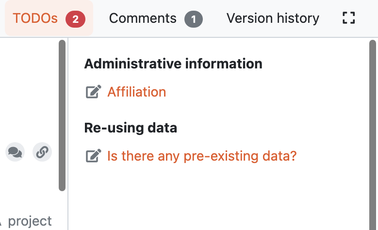
    
    List of TODOs.

Version History
===============

When we open the :guilabel:`Version history` tab from the questionnaire menu bar we can see the list of all the changes that happened in that questionnaire. We can see who and when made what changes groupped by months and days.

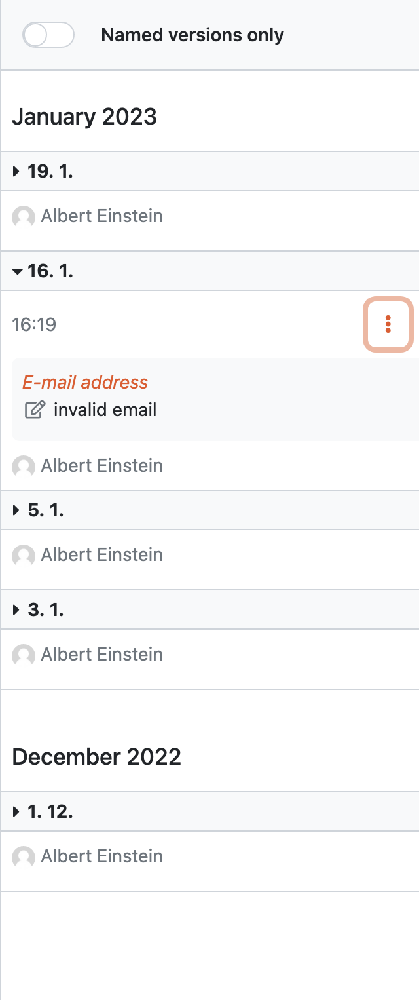
    
    Version history shows all events changing the project.

Name a Version
--------------

At any point (also retroactively) we can name a version. Click on the triple dots on any event we want to name and choose :guilabel:`Name this version`. Then we just fill in name and description of that version. If the event already has a named version, we can choose :guilabel:`Rename this version` instead.

When we have some named versions, we can choose :guilabel:`Named versions only`. Then, we don't see every single change but only the important versions we gave a name to.

View Questionnaire in a Version
-------------------------------

Thanks to the version history, we can see how the questionnaire was filled at any point in the past. We simply find the event in the version history and choose :guilabel:`View questionnaire` from the event menu.

Create Document from an Older Version
-------------------------------------

Sometimes, we might want to create a document from an older version. For example, we created only a PDF document, but later we find out that we also needed a Word document. To do that, we simply find that version in the version history and select :guilabel:`Create document`. Then, we just fill in the details in the form and create the document.

Revert to an Older Version
--------------------------

We can also revert a questionnaire to an older version. We can simply find the desired version in the version history and choose :guilabel:`Revert to this version` from the event menu.

.. WARNING::
    
    Reverting to an older version cannot be undone. It is therefore recommended to create a copy of the project before reverting.
