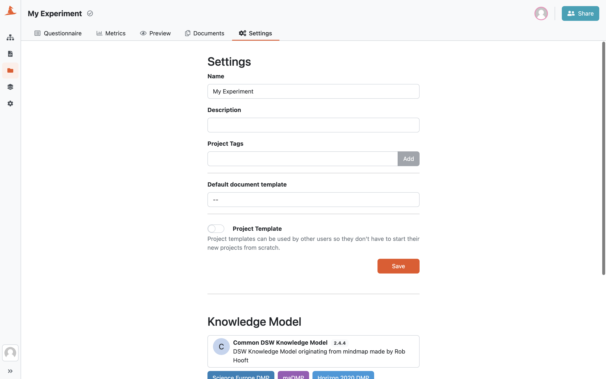

.. _project-settings:

Settings
********

In the :guilabel:`Settings` tab, we can configure some details about the project. First we have a **name** and a **description** to identify the project.

Next, we have **Project Tags**. These can be used for providing some metadata or categorization of the project. In the project list, we can filter the projects by these tags. We can write any text we want as a project tag and DSW will suggest us the tags that are there already in use so we can keep them consistent.

.. NOTE::

    Project tags might be disabled in some DSW instances.

    
    Project settings.

.. _default-document-template:

Default Document Template
=========================

We can set a **default document template** and a **default document format**. These are then used in the :ref:`preview<preview>` tab and also pre-selected when creating a :ref:`new document<new-document>`.

Project Template
================

We can use the project as a :ref:`project template<project-templates>`. If we enable this option, researchers can use it when creating a new project :ref:`from project template<from-project-template>`. Note that we also need to make it visible for other logged-in users in :ref:`sharing<sharing>` settings.

.. NOTE::

    Project template options are visible only for Data Stewards or Admins.

Knowledge Model
===============

We can see the :ref:`knowledge model<knowledge-model>` and its tags used for creating the project. If we want to change that, we can simply create a :ref:`project migration<project-migration>`.

Danger Zone
===========

In the danger zone, we can delete the project. Once the project is deleted it can **no longer be recovered**.