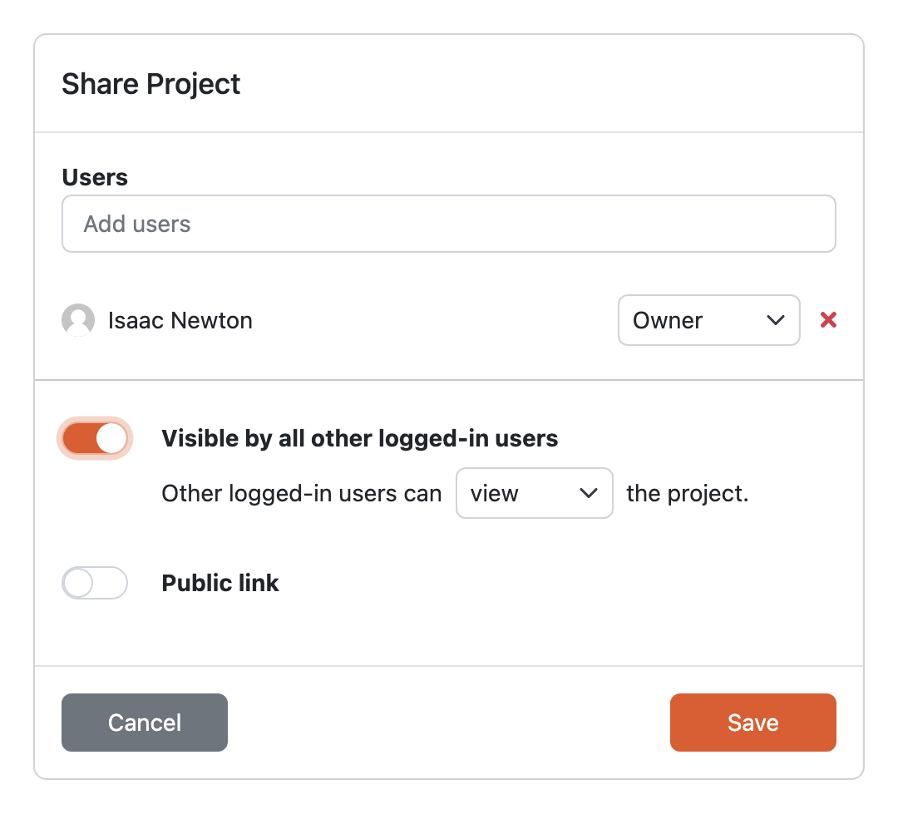

.. _sharing:

Sharing
*******

We can share project with other DSW users or even external collaborators. We can access all the sharing option by clicking the :guilabel:`Share` button in the top right.

    
    Project sharing settings.

There are different roles how we can share the project that can access different project features:

.. raw:: html

    

        <table class="docutils align-default">
            <thead>
                <tr>
                    <th></th>
                    <th>Viewer</th>
                    <th>Commenter</th>
                    <th>Editor</th>
                    <th>Owner</th>
                </tr>
            </thead>
            <tbody>
                <tr>
                    <td>View project</td>
                    <td class="text-center">✔</td>
                    <td class="text-center">✔</td>
                    <td class="text-center">✔</td>
                    <td class="text-center">✔</td>
                </tr>
                <tr>
                    <td>Metrics</td>
                    <td class="text-center">✔</td>
                    <td class="text-center">✔</td>
                    <td class="text-center">✔</td>
                    <td class="text-center">✔</td>
                </tr>
                <tr>
                    <td>Preview</td>
                    <td class="text-center">✔</td>
                    <td class="text-center">✔</td>
                    <td class="text-center">✔</td>
                    <td class="text-center">✔</td>
                </tr>
                <tr>
                    <td>View documents</td>
                    <td class="text-center">✔</td>
                    <td class="text-center">✔</td>
                    <td class="text-center">✔</td>
                    <td class="text-center">✔</td>
                </tr>
                <tr>
                    <td>Comment on project</td>
                    <td class="text-center"></td>
                    <td class="text-center">✔</td>
                    <td class="text-center">✔</td>
                    <td class="text-center">✔</td>
                </tr>
                <tr>
                    <td>Change answers</td>
                    <td class="text-center"></td>
                    <td class="text-center"></td>
                    <td class="text-center">✔</td>
                    <td class="text-center">✔</td>
                </tr>
                <tr>
                    <td>TODOs</td>
                    <td class="text-center"></td>
                    <td class="text-center"></td>
                    <td class="text-center">✔</td>
                    <td class="text-center">✔</td>
                </tr>
                <tr>
                    <td>Version history</td>
                    <td class="text-center"></td>
                    <td class="text-center"></td>
                    <td class="text-center">✔</td>
                    <td class="text-center">✔</td>
                </tr>
                <tr>
                    <td>Create documents</td>
                    <td class="text-center"></td>
                    <td class="text-center"></td>
                    <td class="text-center">✔</td>
                    <td class="text-center">✔</td>
                </tr>
                <tr>
                    <td>Editor notes</td>
                    <td class="text-center"></td>
                    <td class="text-center"></td>
                    <td class="text-center">✔</td>
                    <td class="text-center">✔</td>
                </tr>
                <tr>
                    <td>Sharing settings</td>
                    <td class="text-center"></td>
                    <td class="text-center"></td>
                    <td class="text-center"></td>
                    <td class="text-center">✔</td>
                </tr>
                <tr>
                    <td>Project settings</td>
                    <td class="text-center"></td>
                    <td class="text-center"></td>
                    <td class="text-center"></td>
                    <td class="text-center">✔</td>
                </tr>
            </tbody>
        </table>
    

.. NOTE::

    Some of the following options might be globally disabled in the application settings for the whole DSW instance, therefore not visible on the project level.

The following video tutorial explains and showcases sharing options and tools that can be used while collaborating with others. Some features mentioned in the video are also explained in the :ref:`project questionnaire<project-questionnaire>`.

.. youtube:: ZN0VTbpLrHk
    :width: 100%
    :align: center

Users
=====

We can choose specific users from the DSW instance and their role on the project to grant them access to project features based on the table above. This is a good way to add other collaborators that work together with us on the project. Also, this is the only way to add other project owners.

Visible by all other logged-in users
====================================

We can enable the :guilabel:`Visible by other logged-in users` toggle to grant access to the project for all other users without the need to explicitly list them. Then, we can also choose what the users can do -- **view**, **comment**, or **edit** the project. We cannot grant **owner** access this way though.

This can be useful, when we want to have an example project accessible by everybody. We can simply enable this and choose that other users can **view** the project. We also want to set this up when we create a :ref:`project template<project-templates>`.

Public link
===========

We can enable the :guilabel:`Public link` toggle to grant access to the project to anyone who has the link. We can again choose what they can do -- **view**, **comment**, or **edit** the project. Also, the public link is visible there, so we can simply copy it and send to whoever we want to collaborate with. Then, they don't need a DSW account and still be able to access our project.
