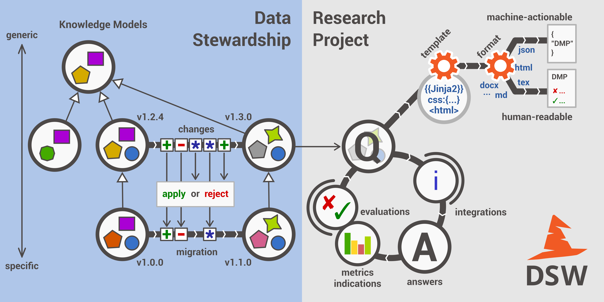

This is develop version.

About DSW
=========

What is Data Stewardship Wizard and how it can help you and your research?

DSW
--------

Data Stewardship Wizard is a joint `ELIXIR CZ <https://www.elixir-czech.cz/>`__ and `ELIXIR NL <https://www.dtls.nl/elixir-nl/>`__ project bringing a simple but powerful solution for researchers to help them understand what is needed for a good, FAIR-oriented Data Stewardship, and to help them to build their own Data Management Plans. The Data Stewardship Wizard can also function as a checklist for data management professionals, like the checklists used by pilots before each flight.

FAIR
--------

The main driver for the DSW is now to offer a convenient helpful tool for data stewards and researchers. Given limited funding, we focus on this mission now. However, from a long-term perspective, the richness of knowledge contained in the Wizard definitively calls for being FAIR. On this page, we track the progress of compliance with the `FAIR principles <https://www.go-fair.org/fair-principles/>`__.

Machine-Actionable DMPs
--------

We are part of the initiative  `#activeDMPs <https://activedmps.org/>`__. Here, we will post updates on concrete steps, mostly with the respect to the identified use cases. The work on this front will continue according to our available capacity and funding.

Learn More
--------

- `DSW Landing page <https://ds-wizard.org/>`__
- `DSW Resources <https://ds-wizard.org/resources>`__
- `DSW Media Kit <https://ds-wizard.org/media>`__
- `Leaflet <https://github.com/ds-wizard/dsw-leaflet>`__
- `Diagrams <https://github.com/ds-wizard/dsw-diagrams>`__