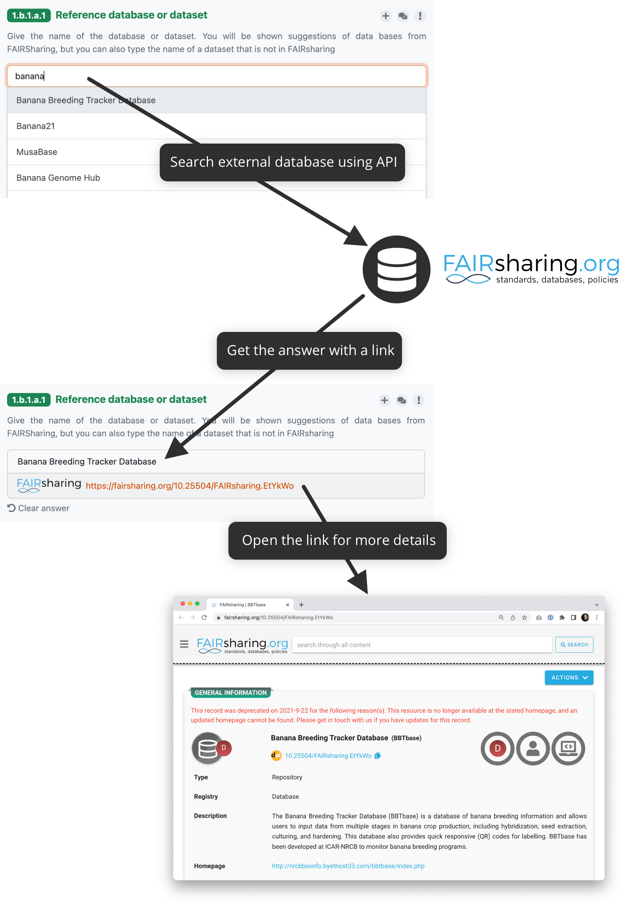

Integration Question - API
**************************

:ref:`Integration question<integration-question>` can be connected to an external resource using its API. We can then search for the results from the external service using the DSW questionnaire interface. When we select an answer it is not only the text (such as a name of the database), but also a link to the external service to the selected item. The whole flow is denoted in the following diagram.

    
    How integration question connected to, for example, FAIRsharing API works.

External Service Requirements
=============================

If we want to connect an external service using the API there are certain requirements for it to make the connection to DSW possible.

- **Allows search using free text**
  
  - There must be a way to send a search phrase to the API so that it can filter the results based on it

- **Returns a JSON response with a list of results**

  - The response must be JSON so DSW can parse it
  - There needs to be a JSON list where all the items matching the search query are
  
- **It is possible to construct a link to the selected item**

  - We also need to be able to construct the link to the item from the data we get in the response so we can provide it with the answer

Configuration
=============

The configuration is done in the :ref:`knowledge model editor<knowledge-model-editor>`. First of all, we need to create a new integration and choose its **Type** to be **API**. Then, there are some metadata, such as **ID**, **Name**, or **Logo URL**.

Request Configuration
---------------------

In the **Request** section, we configure how to make an HTTP requrests to the external service's API. For that, we need to configure the following (the specific values depends on how the API works):

- **Request URL** - what is the URL where we want to send search requests
- **Request HTTP Method** - what HTTP method should be used
- **Request HTTP Headers** - some headers might be needed, such as ``Accept: application/json`` to have a correct response type
- **Request HTTP Body** - if we need to send some HTTP body
- **Allow Empty Search** - some APIs don't work if we try to search with an empty string, turn this of it's the case

There is a special property ``${q}`` that we can use within those fields. The property represents the string that users type to the questionnaire. So for example, we can write **Request URL** as:

.. code-block::

    http://example.com/api/search?q=${q}

Response Configuration
----------------------

In the **Response** section, we configure how to process the JSON respnonse from the external service. For that, we need to configure the following:

- **Response List Field** - where in the JSON response is the list of items corresponding to the search query
- **Respone Item ID** - what field represents an item ID in the returned JSON
- **Response Item Template** - how we want to present the result to the user

We can use Jinja2 templates (`Ginger <https://ginger.tobiasdammers.nl>`_ implementation) in Response Item ID and especially in Response Item Template to make the response item look better.

Secrets and Other Properties
----------------------------

Sometimes, we might need to use some secrets (for example for authentication token), additional properties (such as API URL if we want to use different one for testing and production), or basically any information that we do not want to include in the knowledge model. In that case, we can define some properties in the instance settings.

We need to navigate to :guilabel:`Administration → Settings → Knowledge Models` and there is a field called **Integration Config**. It is a YAML organized by the **Integration ID** at the top level and key value pairs for each property.

We can fill some propertes in. So, for example, if the **INtegration ID** of our integration is *ourIntegration* we can write:

.. code-block:: yaml

    ourIntegration:
        authorizationToken: "abcd"
        apiUrl: "http://example.com/api"

Then, in the configuration of our integration, we can use these properties in the request configuration, so for example the **Request URL** can be:

.. code-block::

    ${apiUrl}/search?q=${q}

And we can add a header such as:

.. code-block::

    Authorization: Bearer ${authorizationToken}

.. NOTE::

    These properties can be accessed only from the integration with matching ID.

Video Tutorial
==============

We have the following video tutorial showing how to set up the integration question using API.

.. youtube:: x-kx6ppVBo0
    :width: 100%
    :align: center

External Resources
==================

- `How to Configure Integration Question in Data Stewardship Wizard <https://medium.com/@fair-wizard/how-to-configure-integration-question-in-data-stewardship-wizard-57f80333fd7a>`_
- `How to Improve Integration Question Item Template in DSW <https://medium.com/@fair-wizard/how-to-improve-integration-question-item-template-in-dsw-31d163272166>`_
- `Ginger Documentation <https://ginger.tobiasdammers.nl>`_