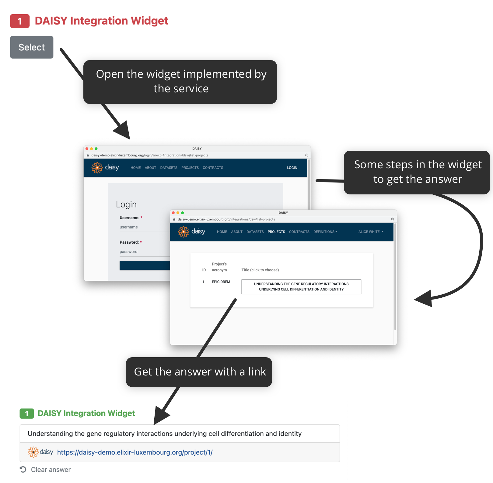

Integration Question - Widget
*****************************

:ref:`Integration question<integration-question>` can be connected to an external resource using a widget integration. When there is this type of question, instead of writing an answer, reserachers click on :guilabel:`Select` button. It will open the widget where they can pick their answer and it is then sent back to the DSW. The whole flow is denoted in the following diagram.

    
    How integration widget connected to, for example, DAISY works.

Configuration
=============

The configuration is done in the :ref:`knowledge model editor<knowledge-model-editor>`. First of all, we need to create a new integration and choose its **Type** to be **Widget**. Then, there are some metadata, such as **ID**, **Name**, or **Logo URL**, as well as the **Widget URL** which is the URL where the widget is deployed. The URL will be open in popup window when researchers click on the :guilabel:`Select` button when filling in the questionnaire.

Implementation
==============

The actual implementation is done using `DSW Integration Widget SDK <https://github.com/ds-wizard/dsw-integration-widget-sdk>`_. We recommend reading the readme and explore the examples to understand how it works.
