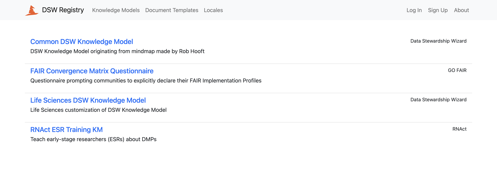

DSW Registry
************

`DSW Registry <https://registry.ds-wizard.org/>`_ is a place where we publish knowledge models, document templates and locales. It is very easy to get those into a DSW instance and use.

    
    DSW Registry with a list of knowledge models.

We first need to connect our DSW instance to the DSW Registry in :ref:`DSW Registry Settings<dsw-registry-settings>`. Once we have that, we can:

- :ref:`Import knowledge models from DSW Registry<km-import-from-registry>`
- :ref:`Import document templates from DSW Registry<doc-template-import-from-registry>`
- :ref:`Import locales from DSW Registry<locale-import-from-registry>`
